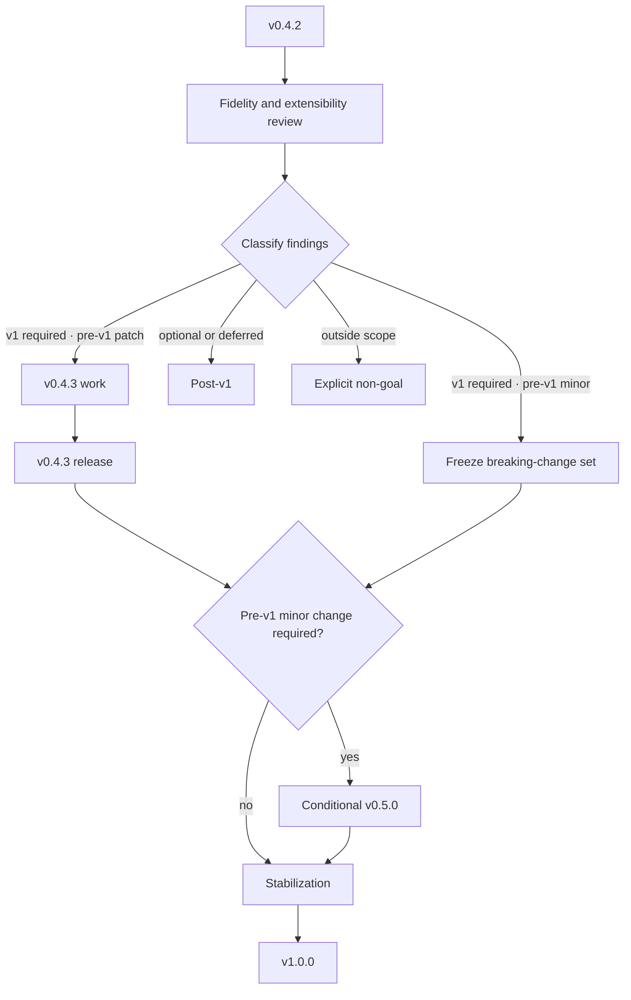

# Roadmap to v1.0.0

_Over the 60 lines [CONTRIBUTING-docs](./CONTRIBUTING-docs.md) recommends. #216
requires one public entry point for the guarantee, non-goals, dependencies, decision
points, and release sequence; issues and ADRs still own every detail and status._

> **TL;DR** — This roadmap defines the scope, review gates, dependencies, and
> release sequence on the way to smocket v1.0.0. Issues and decision records own
> the details and status; this page makes their relationship and the public plan visible.

## Direction

smocket reviews development decisions through five lenses: Fidelity, Extensibility,
Reliability, Productivity, and Sustainability. [#214] tracks their durable definition;
this roadmap will link that project document when it lands.

  

The lenses are decision tools, not a second issue taxonomy or five one-to-one GitHub
labels. The existing `fidelity` label remains for work whose central task is observing
real Socket.IO. Issues otherwise keep their ordinary work-type labels, documented in
[labels.md](./labels.md), and their target milestone.

## The v1.0.0 guarantee

v1.0.0 aims to provide stable observable behaviour and public types within the documented
Socket.IO logic-layer subset. It does not promise to reproduce network transport or every
public Socket.IO API.

[scope.md](./scope.md) owns that boundary. [conformance.md](./conformance.md) owns the
behaviours proved by running the same cases against real Socket.IO and smocket.
[differences.md](./differences.md) owns intentional divergences and smocket-only APIs, and
[ADR 0019](./decisions/0019-what-counts-as-a-breaking-change.md) governs compatibility
judgements for those published promises. An unverified behaviour is not described as
absent or supported.

### Non-goals

The following remain outside the v1.0.0 guarantee because an in-memory implementation has
no real network on which to reproduce them:

- WebSocket or HTTP long-polling transport and transport fallback;
- heartbeat and ping timeout;
- automatic reconnection after a real network failure;
- multi-server delivery, including Redis adapters and `serverSideEmit`;
- binary encoding and Engine.IO framing.

An explicit simulation hook for testing an application's disconnect or reconnect handling
is a separate feature question. Such a hook would not claim to reproduce a real network.

### Review before v1

Before v1.0.0, the project will review the documented guarantee for:

- conformance defects still inside that guarantee;
- missing capabilities required by core use cases;
- public extension points that must be stable before v1;
- divergences that must be documented explicitly; and
- work to defer until after v1 or confirm as a non-goal.

The review evaluates scenarios, not method names alone: return values, event order, error
handling, and state transitions are observable parts of compatibility. A required result
must link to a concrete issue or decision record before it enters the v1.0.0 milestone.

## Classifying and tracking findings

| Finding                                                           | Roadmap treatment                                                                   |
| ----------------------------------------------------------------- | ----------------------------------------------------------------------------------- |
| Confirmed defect inside the v1 guarantee                          | Required; track with an issue and the `v1.0.0` milestone                            |
| Missing capability or extension point required by a core use case | Required candidate; decide in a concrete issue before adding it to the release gate |
| Compatible improvement that does not block existing use           | Optional or post-v1                                                                 |
| Change to a public extension point                                | Decide explicitly before v1; apply ADR 0019                                         |
| Directionally aligned but unnecessary for v1                      | Post-v1                                                                             |
| Outside the documented scope                                      | Explicit non-goal                                                                   |

The [v1.0.0 milestone] is the live list and release gate for required work. Deferred work
with a target version uses that version's milestone; work without one stays in [#217] or a
linked follow-up issue. “Post-v1” promises another review, not implementation in the next
release. Work that decides, reviews, or documents the v1 guarantee may itself use the
milestone; areas that are merely unverified do not become implementation promises by
default.

## Dependencies and decision points

Only dependencies that affect release order belong here; issue bodies own their detailed
requirements and progress.

- The realistic application in [#113] and published-package environment in [#208] feed
  the application validation and productivity reports in [#218].
- The `Socket` export decision in [#178] must land before the v1 public API guarantee is
  finalized.
- [#214] defines the five lenses used during review, while [#217] defines how development
  and validation continue after v1.
- [#213] remains the parent direction discussion for roadmap feedback and new use cases.

## Pre-v1 release sequence

[ADR 0019](./decisions/0019-what-counts-as-a-breaking-change.md) classifies every change.
The roadmap applies its pre-v1 shift without duplicating the decision table.

### v0.4.3

Changes that ADR 0019 places in a pre-v1 patch may ship together when they can be reviewed
and verified as one release. This can include measured conformance corrections, newly
covered Socket.IO surface, compatible public-type or smocket-only API improvements,
documentation, refactoring, and maintenance.

A conformance correction may change an observed result without withdrawing a project
promise. Its release notes still state the before and after, the governing ADR 0019 row,
and the test that proves the corrected behaviour. A change classified as a pre-v1 minor
does not ride in v0.4.3.

### Conditional v0.5.0

If required pre-v1 work falls into an ADR 0019 major-class row, it ships as the pre-v1
minor v0.5.0. Examples include changing a documented intentional divergence, making an
existing public type call stop compiling, raising the supported Node.js floor, or making
an incompatible change to a smocket-only API.

The project will group necessary changes where practical and then freeze that breaking
change set before the v1 candidate. If no such change is required, v1.0.0 need not pass
through v0.5.0.

### Stabilization

After the last pre-v1 minor, conformance corrections, documentation fixes, and compatible
small improvements use that line's patch releases. If v0.5.0 exists, these may be v0.5.1
or v0.5.2; another required pre-v1 minor would prompt consideration of v0.6.0. The roadmap
does not lock intermediate version numbers or release count in advance.

## Changing this roadmap

Issues and ADRs remain the source of truth for requirements and technical decisions. To
change a guarantee, non-goal, dependency, or release policy:

1. Record the reason in a concrete issue or ADR.
2. Classify it as required, optional, post-v1, or out of scope.
3. Check its target release and dependencies.
4. Update the issue milestone and this roadmap together.

A new finding is not automatically a v1 requirement. It enters the release only after the
project determines that it affects the published scope or an explicit v1 guarantee.

## Related work

- Direction discussion: [#213]
- Five development lenses: [#214]
- This public roadmap: [#216]
- Post-v1 development and validation: [#217]
- Application validation and productivity reports: [#218]
- Release gate: [v1.0.0 milestone]
- Version compatibility: [ADR 0019](./decisions/0019-what-counts-as-a-breaking-change.md)

[#113]: https://github.com/electrohyun/smocket/issues/113
[#178]: https://github.com/electrohyun/smocket/issues/178
[#208]: https://github.com/electrohyun/smocket/issues/208
[#213]: https://github.com/electrohyun/smocket/issues/213
[#214]: https://github.com/electrohyun/smocket/issues/214
[#216]: https://github.com/electrohyun/smocket/issues/216
[#217]: https://github.com/electrohyun/smocket/issues/217
[#218]: https://github.com/electrohyun/smocket/issues/218
[v1.0.0 milestone]: https://github.com/electrohyun/smocket/milestone/3
